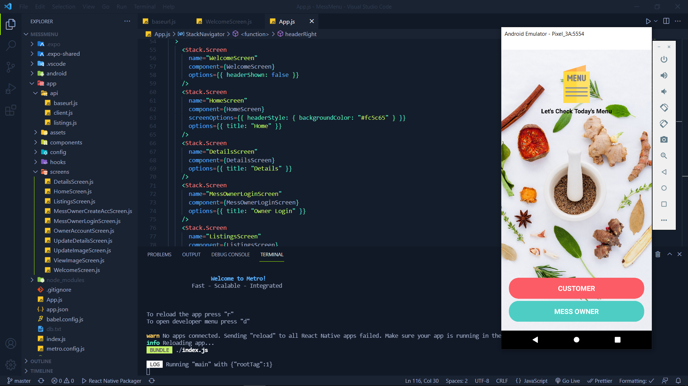
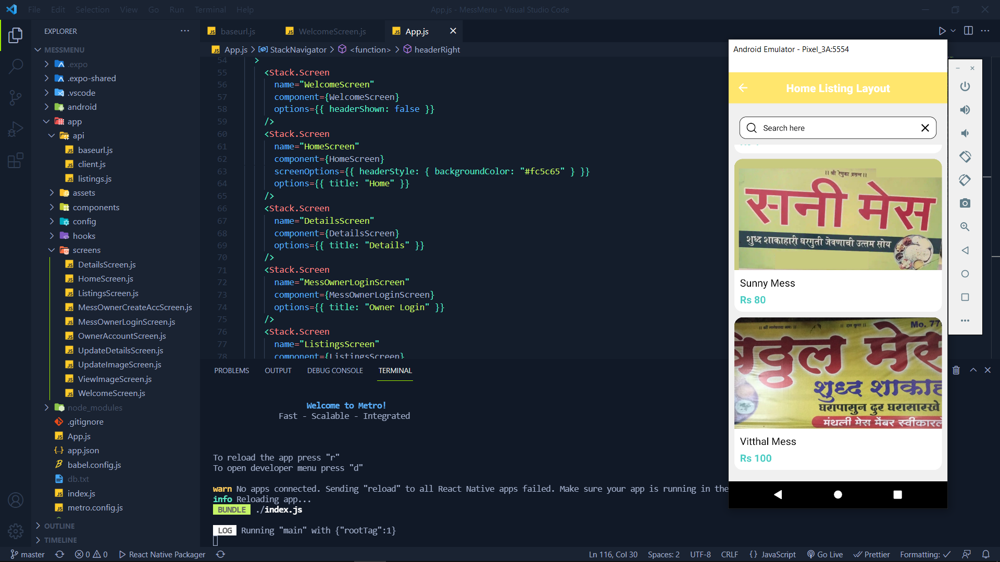
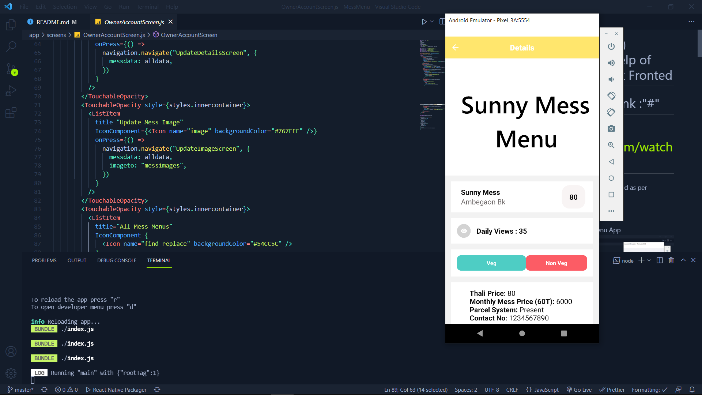
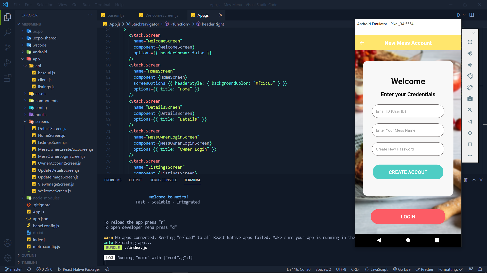
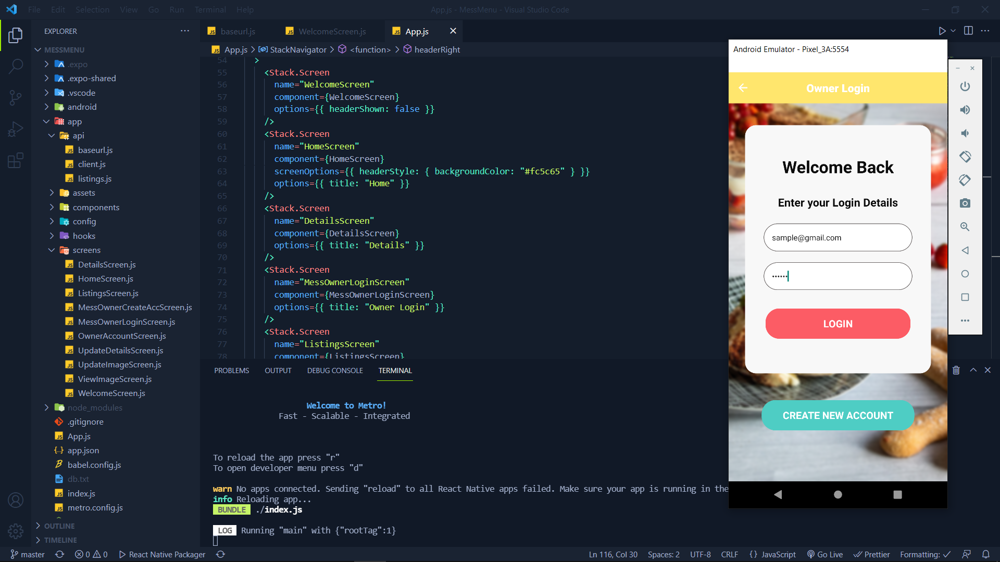
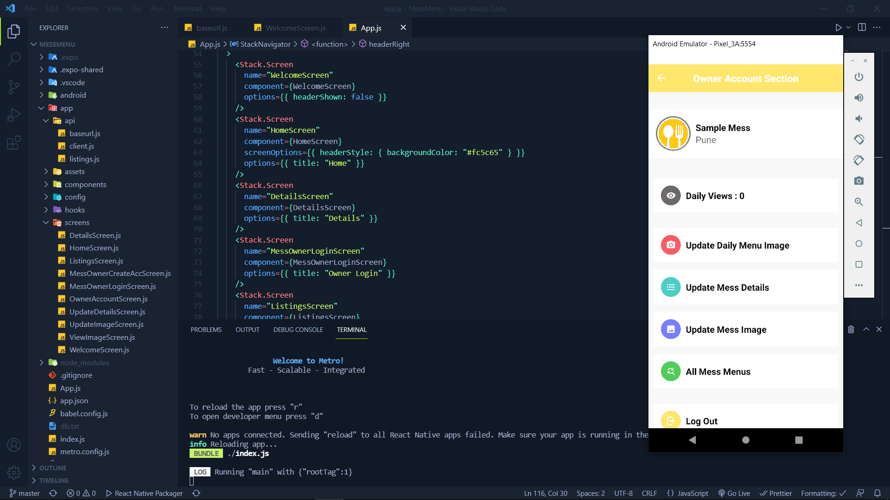
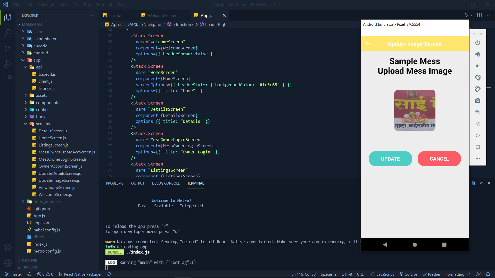
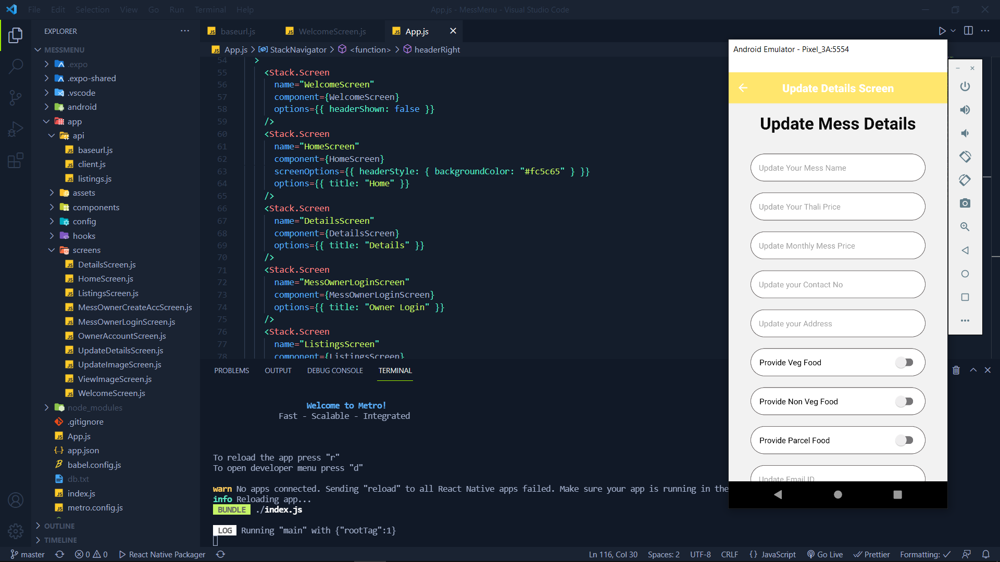

# MessMenu (Hybrid App)

## <b>Frontend:-</b> React Native Framework,Reactjs, modules, Js, CSS.  <b>Backend:- </b>nodejs, expressjs, azure mongodb, blobstorage, modules, azure vm, azure services.

## New Prototype Video Link :"#"

> OLD Demo Video Link: https://www.youtube.com/watch?v=xetzHk-LvHg  
> Current Present things & They will be updated as per requirement.

## UI & Working:-

Welcome Screen After Starting MessMenu App

 

Customer can easily view All Mess and there pricing

 

After Clicking on Mess Customer can view Details of Mess

 

New Mess Owner can Create Account (Signup) in simple way

 

Mess Owner can easily login using email and password (encrypted)

 

After Login Mess Owner can see there mess details and update options

 

Mess Owner can update menu and mess dp using imageupload page

 

Mess Owner can update all the details of there mess information

## All Backend Info Present on MessMenu-Backend-Repo README.md file

## Features:-

<li > Mess Information
<li > Mess Menu Viewing
<li > Mess Thali Price
<li > Mess Parcel System Confirmation
<li > Mess Contact Details
<li > many more....

## Screens:-

1. WelcomeScreen - For Customer & owner login (Customer login will be as guest, for starting use only owner for login).
2. ListingScreen (Primary Customer Viewing) - Useful as homepage it can show all logo, Name & Sub-detail in very good manner.
3. DetailsScreen - It will show details of mess & it's picture after clicking on it.
4. ViewImageScreen - Will be used to view the screen when user click on any image.
5. HomeScreen (Optional (Not Used))- It shows all the mess list & there logo & name & sub-details (Thali price, location, etc.)
6. MessOwnerLoginScreen - Mess Owenr can login using this Screen to access there settings.
7. MessOwnerCreateAccScreen - New Mess Owner can create account using this Screen & password will be encrypted then saved.
8. OwnerAccountScreen - It shows the details about Owner Mess info and owner can change information as they wish.
9. UpdateDetailsScreen - It will allow mess owner to update there messs details (thali price, name, pass, etc).
10. UpdateImageScreen - It will allow user to update there mess menu & mess dp image.
11. TestScreen - For basic testing. (Uncommited)

## Custom Components:-

Around 20+ Components
